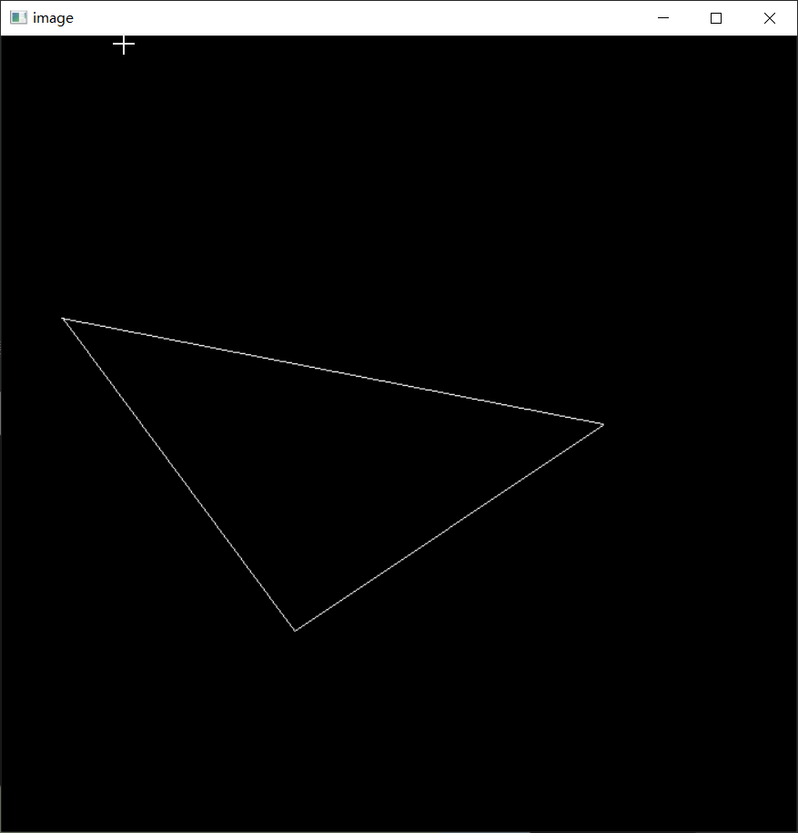

[toc]
# 0. 序言

​	这是图形学入门课程GAMES101的作业备份.

课程主页: [GAMES101: 现代计算机图形学入门](https://sites.cs.ucsb.edu/~lingqi/teaching/games101.html)

视频网址: [GAMES101-现代计算机图形学入门-闫令琪_哔哩哔哩_bilibili](https://www.bilibili.com/video/BV1X7411F744/?spm_id_from=333.337.search-card.all.click&vd_source=adc8614d6ca1140f400db0450edf8018)

# 1. 环境部署

我使用windows操作系统, 环境设置会比linux更复杂些.

* cmake-gui图形界面工具: 按网上教程下载安装cmake-gui
* 安装vs, 并下载c++开发依赖

## 1.1 步骤简记

### 1.1.1 构建项目

Where is the source code选择`CMakeList.txt`所在目录

依次点击`Configure`, `Generate`生成vs的`sln`解决方案. 

### 1.1.2 配置解决方案

​	其实就是设置**外部依赖库的头文件以及静态lib或动态dll**. GAMES101将使用到`opencv`, `Eigen`等.

* 引入头文件

  修改附加包含目录

* 外部依赖库

  修改库目录(存放lib或dll文件的目录)

​	修改附加依赖项

​	如果你没有opencv库, **在网上搜索它的官网[Releases - OpenCV](https://opencv.org/releases/), 找到对应操作系统的版本即可**, 如果喜欢折腾, 也可以下载源码并重复上面流程, 编译opencv, 这样做得到的目标库更兼容你的操作系统.

​	上面的路径**不要含有中文**, 可以使用环境变量, 我懒就用绝对路径了.

​	opencv_world480d.lib中d表示它是用于debug模式的库. 如果以发布模式生成项目, 换用opencv_world480.lib.

### 1.1.3 生成并运行

​	配置好后就可以运行项目了.

# 2. 作业内容与结果

​	有点久远, 具体实现细节记得不多了. 可能有误.

## 2.1 投影

​	投影矩阵一般有**透视矩阵和正交矩阵**, 模型需要经过m(模型矩阵变化), v(摄像机矩阵变化)和p(投影矩阵), 变化到一个[-1, 1]^3的单位立体标准空间中. 最后再从标准空间向屏幕空间(像素空间)进行一次转换. 像素点的属性值**根据重心坐标通过它周围的顶点插值得到**, 中心坐标的计算可以是屏幕空间, 也可以是原始空间.

 

## 2.2 z-buffer

​	栅格化中的z-buffer实现基元的遮挡关系(绿色三角在蓝色三角前).

## 2.3 Blinn-Phong模型

​	Blinn-Phong是种简单的渲染模型, 包括漫反射和镜面反射部分. 公式为
$$
L_{diffuse} = k_d * \frac{I}{r^2} * max(0,\overline{l}\cdot\overline{n} ) \\
L_{specular} = k_s * \frac{I}{r^2} * max(0,\overline{h}\cdot\overline{n} )^p \\
其中, k_d和k_s是系数, I是模拟光强, \overline{l}是入射光方向, \overline{h}是半程向量, p一般取200到300.
$$
​	完成normal map, reflect map 和 texture后的结果

## 2.4 贝塞尔曲线

​	贝塞尔曲线在GAMES102中也有提及, 它是B样条和非均匀有理B样条的基础

​	它由控制点控制, 可以使用几何法画出, 经过起始点, 本质是多项式基函数的拟合.

## 2.5 Whitted Style ray tracing

## 2.6 BVH加速求交

​	在光线追踪中, 使用BVH和光线进行求交, 可以确定可能与光线相交的三角面片 避免遍历所有三角面片.

​	可以参考[Slide View : Computer Graphics : 15-462/662 Fall 2015](https://15462.courses.cs.cmu.edu/fall2015/lecture/acceleration/slide_025), 它使用一种类似桶算法的方式将三角面片归入到不同的盒子中.

​	结果

## 2.7 基础光线追踪 (基于CPU的离线渲染)

最重要的渲染方程
$$
L_o(p, w_o) - \int_{\Omega^+}f_r(w_i\rightarrow w_o)L(p, w_i)cos\theta dw_i \\
其中, f_r(w_i\rightarrow w_o)是BRDF.
$$
可以说, 很多图形学渲染的研究, 都是对上面式子的简化和近似(因为算力不足).

以下是使用微表面材质渲染的结果

光线追踪这部分内容最难, 也最有趣, 内容很多, 需要花不少时间笑话. 老实说, 自己对辐射度量学的知识一直是一知半解, 2年后已经快忘光了, 我记了纸质笔记, 有空再回顾吧. 

​	上面的渲染使用了多线程(注意避免cpu进行缓存同步), 时间可以由原来的10几分钟缩短到2分钟左右. 注意使用**发布模式生成**, 使用的库不要是debug的(如opencv_world480d.lib换成opencv_world480.lib).

## 2.8 绳子模拟

​	这部分比较好理解, 计算弹力, 重力, 应用牛二定律计算加速度. 加速度计算速度, 加上阻尼等约束, 使用欧拉方法(隐式或显示)更新质点位置就好. 作业中使用一种Verlet4阶方法更新位置, 它更稳定.

### 2.8.1 简单的梯度下降解逆向运动学

​	利用误差的梯度下降法, 解一个有两条机械臂和一固定点的逆向运动.

# 3. 小结

​	2025年了如果还有小伙伴一起学习GAMES101, 并与到困难的话, 或许我的代码能帮到你(自己挺菜的, 代码写得不好, 可以借助AI来解读). 当初学习这个网课还是很有趣的. 有空还会再学习它的其他系列.
